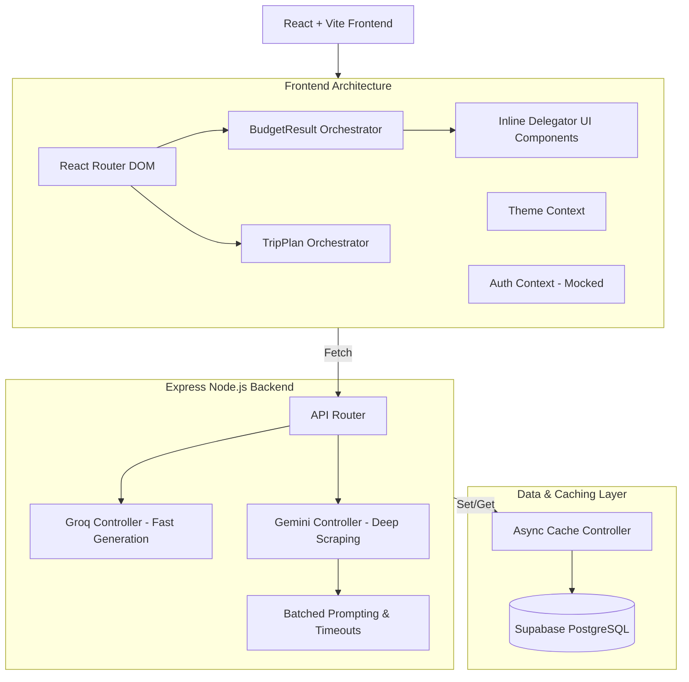

# Master Project History & Architectural Decisions

This document serves as the master record of all major architectural, design, and logic decisions made throughout the lifecycle of the NEXT STOP Trip Planner project. 

## 🗺️ High-Level System Architecture

---

## 1. Frontend Architectural Decisions

### 🏗️ Orchestrator/Delegator Pattern vs. Component Fragmentation
- **The Challenge**: As pages like `TripPage` and `BudgetResult` grew, they became massive monolithic files.
- **Initial Attempt**: We tried to extract sub-components (like `StayCard`, `TransportCard`) into separate files (`/BudgetResult/StayCard.jsx`).
- **Final Decision (Option 1)**: We encountered severe UI regression bugs ("the big blunder") where extracting components broke context and shared UI imports. **Decision:** We keep UI components *inline* inside their parent orchestrator (e.g., inside `BudgetResult.jsx`) if they heavily rely on local state and shared functions. This prevents over-engineering and keeps the codebase robust.

### ⚡ Vite Code-Splitting
- **The Challenge**: Vite warned about `index.js` exceeding the 500kB limit.
- **The Decision**: Implemented `React.lazy()` and `<Suspense>` for all major route components (`AboutPage`, `BudgetPage`, `PlanTripPage`). This reduced the initial load size significantly and solved the Vite chunk warnings.

---

## 2. AI & Backend Strategy

### 🧠 Model Selection: Groq vs. Gemini
- **Groq (Llama 3)**: Selected for the `tripController` because it offers blazing-fast inference, which is critical when generating multi-day itineraries.
- **Google Gemini (3.6 Flash)**: Selected for `spotInfoController` due to its superior reasoning and ability to scrape structured data (opening hours, entry fees, rules) perfectly.

### ⏱️ Beating the Gemini API Limits (Rate Limits & Timeouts)
- **The Challenge (504 Timeout)**: Initially, iterative fetching caused the Vercel/Hosting 60-second limit to time out.
- **The Middle Attempt**: We switched to `Promise.all` to fetch 10-15 spots concurrently. However, this instantly hit the Gemini free-tier **429 Rate Limit**, causing silent failures across all spots.
- **Final Decision**: We reverted to a **Single Batched Prompt** (sending all spots in one massive array prompt to Gemini). We wrapped this in a strict `15000ms` `Promise.race` timeout to ensure the backend fails fast and gracefully, returning a `504` to the frontend which then displays a "Try Again" button.

---

## 3. Data & State Management

### 💾 The Caching Layer (Supabase)
- **The Challenge**: Hitting LLMs for every single user request is slow and expensive.
- **The Decision**: Built an `AsyncCache` utility powered by Supabase. We cache `spotInfo` and `itinerary` results using highly specific string keys (e.g., `spotinfo:taj_mahal:agra`). 
- **TTL**: We set a 30-day Time-To-Live (TTL) on cached items. This means once a popular spot is fetched by the AI, it is instantly loaded for all subsequent users.

### 🔒 Authentication (Current State)
- **The Decision**: Authentication (`AuthContext.jsx`) is currently **mocked** using `localStorage` to simulate network delays and allow frontend UI development without being blocked by backend OAuth configuration.

---

## 4. UI / UX Principles

### 🎨 Styling & Theming
- **The Decision**: Relied on inline CSS-in-JS linked to a global `theme` object. This allows seamless transitions between location-based themes (e.g., Blue for Goa, Gold for Rajasthan) without wrestling with CSS classes.

### 🔄 Graceful Error Handling
- **The Decision**: Never show raw API errors. If the backend returns a `504` (Timeout) or `503` (Unavailable) from Gemini, the UI intercepts this and displays a sleek **"🔄 Try Again"** button on the `EntryTicketsCard` instead of crashing the page.

### ✨ Micro-Animations
- **The Decision**: Instead of standard text "Loading...", we use beautiful `ShimmerSkeleton` components. All clickable cards utilize a standard `.hover-card` global CSS class to ensure tactile, cubic-bezier hover states across the entire application.

---

## 5. Recent Fixes & Features (September 2026)

### 🚀 Search Flow & UI Reductions
- **Redesigned Search Flow**: Streamlined the location selection flow. Previously required multiple enter clicks. Now: `State Name -> Auto-filters Cities (real-time) -> Click City -> Map`. Gives users more room to scroll and view city photos.
- **Questions Page Disabled**: Temporarily disabled and bypassed the "Questions" questionnaire section for the upcoming beta launch as it currently serves no critical purpose.

### 🗺️ Geographical & Map Fixes
- **City Boundaries Fallback**: Addressed an issue where several cities had no geographical polygon boundaries in our dataset. Implemented a fallback mechanism to render a clean, round circle boundary for any city lacking strict coordinate data.
- **Island Disablement**: Hard-disabled island locations (Andaman & Nicobar, Lakshadweep) by setting `built: false` and `available: false` in the dataset. Decided to postpone island logistics (ferries/ships) research until after the beta launch.

### 🚌 Transport & Budget Logic
- **Global Transport Distance Logic**: Fixed a bug where the "Bus" option was only being hidden for Goa. Deployed a global `haversineDistance` calculation: if the straight-line distance from origin to destination exceeds 1000km, the Bus option is automatically disabled for *all* locations.
- **Granular Trip Summary**: Upgraded the `TripOverviewTab` UI. It now proudly displays the exact selected hotel name (e.g., *Taj Mahal Palace*) and detailed transport class (e.g., *Train (SL)*) instead of generic categories.
- **Budget Distribution**: Overhauled the Trip Summary to display precise budget slices. 
  - Stay and Transport now display their specific allocated cost inline. 
  - Added a new **🎟️ Activities** row for spot ticket prices.
  - **Graceful Failure (The Missing Ticket Price Problem)**: If the Gemini API fails to fetch the ticket price for any selected spot, that cost is gracefully absorbed into the flexible `Food Buffer`. The UI flags the Activities cost as `(Partial)` and appends a polite italicized disclaimer at the bottom explaining the data fallback.
- **UI Cleanup**: Removed the "cached results load instantly ⚡" text from the itinerary footer to keep the UI spotless.
